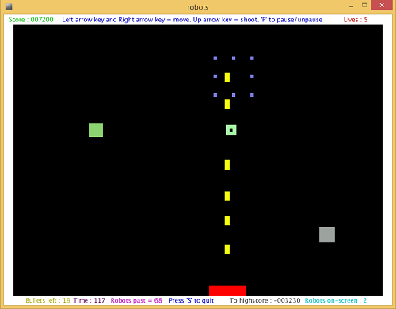

# processing.org
Sample "processing.org" games/apps.
==================================
This repo contains some sample projects that I worked on while partaking in an [Academy of Code](https://www.theacademyofcode.com/) course.

----------------------------------

## [Robot Shooter Game](https://github.com/sktylr/processing.org/tree/master/robots)
----------------------------------

This game is a clone of a space invaders style game. It features animation, high score logging (including taking user input), difficulty increases and was my first introduction to object oriented programming

